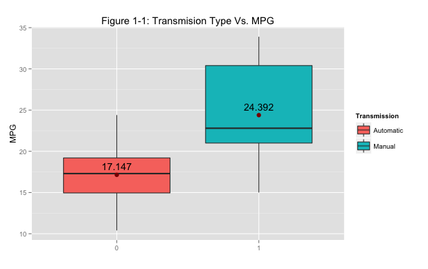
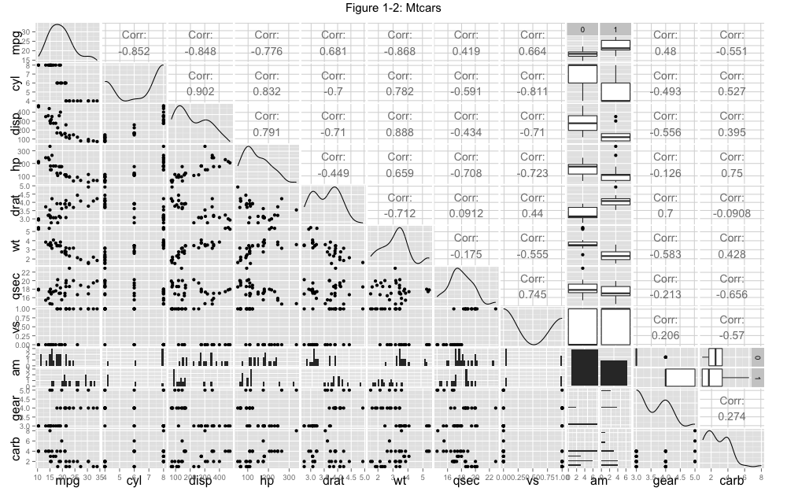

### Executive Summary
This is the course project for the Regression Models class. The goal of this project is analyzing the <code>mtcars</code> data set and the relationship between a set of variables of the data set and miles per gallon (MPG) as the outcome.  Two particular questions of interests are as following:

        * Is an automatic or manual transmission better for MPG?
        * What is the quantified MPG difference between automatic and manual transmissions?

The analysis shows us that 

        * The average MPG of automatic tranmission and manual transmission cars are siginificantly different. 
        * Holding other variables constant, manual transmission cars yield 0.18 higher MPG than automatic cars. 

### Data Exploratory
```{r echo=TRUE, warning=FALSE,message=FALSE}
require(datasets); data(mtcars); require(GGally); require(ggplot2); require(car)
str(mtcars)
```
First, we do some basic data exploration to see the relationships between variables of the data set. <strong>Firgure 1-1</strong> (Appendix) is a box plot shows the different in MPG of two different groups of cars, based on their transmissions.  From the plot, it looks like manual transmission cars give a better MPG than automatic transmission cars.  Mean values are <strong>24.392</strong>, for manual cars and <strong>17.147</strong>, for automatic ones.

A pairs plot (see Figure 1-2 in the Appendix) can tell us that variables like <code>disp</code>, <code>wt</code> and <code>cyl</code> are highly correlated with the dependend variable mpg.  The variables <code>wt</code> and <code>disp</code> have high correlation.  In common sense, a bigger car means bigger displacement is the heavier one.  Thus we just need to include one out of these two in building our regression models; and in this case, we pick <code>wt</code> for its higher correlation to <code>mpg</code>.  However, the questions of interests focus on how transmission types effecting on the mpg.  We include variable  <code>am</code> in our model. 

### Inference analysis
We do a t-test on two group of cars; one with manual transmission and the other with automatic transmissionis.  Assumptions of the test are nomral distribution of the data; two groups of cars are unpaired and have different variances.
```{r echo = TRUE}
t.test(mpg ~ factor(am), data = mtcars, paired = FALSE, var.equal = FALSE, alternative="two.sided")
```
We gather from the test results that the p-value is <strong>0.001374</strong> which is very small; and the 95% confident interval is from <strong>-11.280194</strong>  to <strong>-3.209684</strong> which doesn't contain 0.  So far, we may say manual transmission cars yield higher mpg than automatic transmission ones.

### Regression analysis
```{r echo = TRUE}
# nesting models
fit1 <- lm(mpg ~ factor(am), data = mtcars)
fit2 <- update(fit1, mpg ~ factor(am) + wt)
fit3 <- update(fit1, mpg ~ factor(am) + wt + cyl)
anova(fit1, fit2, fit3)
```
The <code>fit3</code> model which consists of the variables <code>wt</code> and <code>cyl</code> as cofounders and <code>am</code> as the the indepedent variable is the best model.  The results from the above ANOVA test gives <code>fit3</code> the most significant level of p-value.

Adjusted R-squared of <code>fit3</code> is <strong>0.8122</strong> (see Output 3 - Appendix) is almost as high as the adjusted R-squared of the model which includes all variables, <strong>0.8066</strong> (see Output 4 - Appendix).  Therefore, we can confidently conclude that <code>fit3</code> model captures 82% of variability and it is the best model.

```{r echo=TRUE}
par(mfrow = c(2, 2))
plot(fit3)
```

- In the upper left hand plot, Residuals Vs Fitted, data points lie under and above zero, excepts some outliers, and seem not to have any obvious pattern. It supports the indepedent condition of the data.
- Normal Q-Q plot indicates the data is normally distributed.

The above observations concrete our conclusion of the <code>fit3</code> model.

### Appendix
<strong>Output 1</strong>
```{r echo=TRUE}
summary(fit1)
```

<strong>Output 2</strong>
```{r echo=TRUE}
summary(fit2)
```

<strong>Output 3</strong>
```{r echo=TRUE}
summary(fit3)
```

<strong>Output 4</strong>
```{r echo=TRUE}
newCars = mtcars
newCars$am <- factor(newCars$am)
fitAll <- lm(mpg ~ ., data = newCars)
summary(fitAll)
```

